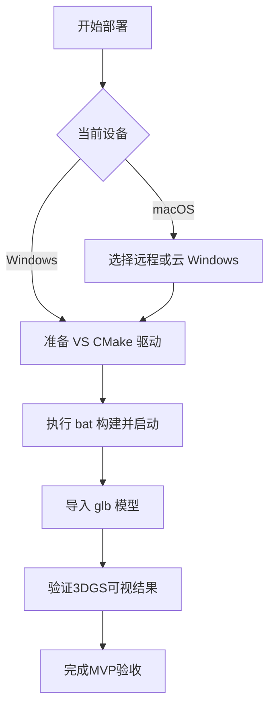

# Mesh2Splat 本地部署 PRD（MVP）

## 1. 文档信息
- 产品名称：Mesh2Splat 本地部署方案
- 版本：v1.0（MVP）
- 目标仓库：`electronicarts/mesh2splat`
- 仓库地址：<https://github.com/electronicarts/mesh2splat>
- 文档目标：定义 Windows 与 macOS 的可落地本地部署路径，并给出最小可用产品（MVP）验收口径。

## 2. 背景与问题
Mesh2Splat 的核心价值是将 3D Mesh 快速转换为 3D Gaussian Splatting（3DGS）表示，适用于 3DGS-only 渲染、初始化优化流程和资产实验验证。  
当前官方文档明确给出了 Windows 构建流程，但未给出可直接照搬的 macOS 原生构建路径。

### 2.1 关键依据
- 官方 Windows 构建说明：<https://github.com/electronicarts/mesh2splat/blob/main/README.md>
- 官方 Release 构建脚本：<https://raw.githubusercontent.com/electronicarts/mesh2splat/main/run_build_release.bat>
- CMake 非 Windows 分支仍为占位：<https://raw.githubusercontent.com/electronicarts/mesh2splat/main/CMakeLists.txt>
- OpenGL 上下文要求较高（4.5 core）：<https://raw.githubusercontent.com/electronicarts/mesh2splat/main/src/glewGlfwHandlers/glewGlfwHandler.cpp>
- Shader 使用 `#version 460 core`、SSBO、atomic counter：<https://raw.githubusercontent.com/electronicarts/mesh2splat/main/src/shaders/conversion/converterFS.glsl>

说明：MVP 环境门槛按更严格条件统一定义为 OpenGL 4.6 Core，以避免低版本驱动导致 shader 编译或运行失败。

## 3. 产品目标（MVP）
1. 在 Windows 10/11 上完成稳定部署闭环（构建、运行、导入 `.glb`、查看 3DGS 结果）。
2. 为 macOS 用户提供可执行的替代交付路径（远程/云 Windows 环境）。
3. 输出可复用的操作手册和验收标准，确保团队成员可独立复现。

## 4. 非目标（MVP 不做）
1. 不承诺 native macOS 图形后端移植。
2. 不重构渲染后端（Metal/Vulkan/抽象层改造）。
3. 不扩展输入格式（MVP 仅按 `.glb` 路径验证）。

## 5. 用户与场景
- 图形开发：需要快速验证 Mesh 到 3DGS 转换效果。
- 技术美术：需要验证模型与材质在转换后渲染结果。
- 工具链工程：需要搭建可复用、可演示、可交接的部署环境。

## 6. 方案设计

### 6.1 主路径（Windows 原生）
- 环境：Windows 10/11、Visual Studio 2019/2022（Desktop development with C++）、CMake >= 3.21.1、最低要求 OpenGL 4.6 Core 能力的 GPU 驱动。
- 构建：执行官方 `run_build_release.bat`。
- 运行：从 `bin/Release` 启动程序并加载 `.glb` 验证。

### 6.2 macOS 替代路径
- 采用远程 Windows 主机、云 Windows 工作站或企业可控的 GPU 直通 Windows 环境。
- 在该 Windows 环境内执行与主路径同样的构建和运行流程。
- macOS 侧负责远程接入和结果使用，不承担 native 编译交付。

## 7. 功能需求
- FR1：可从源码完成 Release 构建并生成可执行文件。
- FR2：可导入至少 1 个 `.glb` 模型并执行转换。
- FR3：可在内置渲染器中查看转换结果。
- FR4：提供常见失败场景的排障指引。

## 8. 非功能需求
- NFR1：新成员按手册可在单次尝试内完成闭环。
- NFR2：多台机器可重复执行并获得一致流程结果。
- NFR3：首次跑通时长可被记录并用于后续优化。

## 9. 用户流程（MVP）

## 10. 验收标准（Definition of Done）
1. 构建成功：`run_build_release.bat` 无致命错误。
2. 程序可启动：可执行文件正常运行，无立即崩溃。
3. 功能可用：成功导入至少 1 个 `.glb` 并看到渲染结果。
4. 文档可复现：另一位成员按手册可独立复现。

## 11. 风险与缓解
- 风险 A：误判 macOS 可直接原生部署。  
  缓解：MVP 文档明确“macOS 走替代路径，不承诺 native”。
- 风险 B：环境依赖不完整（VS workload、CMake 版本不足）。  
  缓解：手册增加前置检查与错误对照表。
- 风险 C：图形驱动能力或配置问题。  
  缓解：优先使用满足 OpenGL 能力的机器，记录驱动版本基线。

## 12. 里程碑建议
- M1（D1-D2）：确认范围并完成 PRD 与 Runbook 初稿。
- M2（D3-D4）：Windows 跑通并补齐失败案例。
- M3（D5）：macOS 替代路径验证与验收收口。

## 13. 后续演进（非 MVP）
- 评估 Linux 路径可行性与维护成本。
- 若业务确需 macOS 原生，单独立项开展图形后端迁移评估与 PoC。
